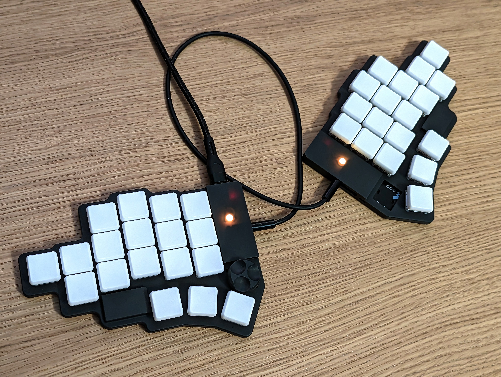
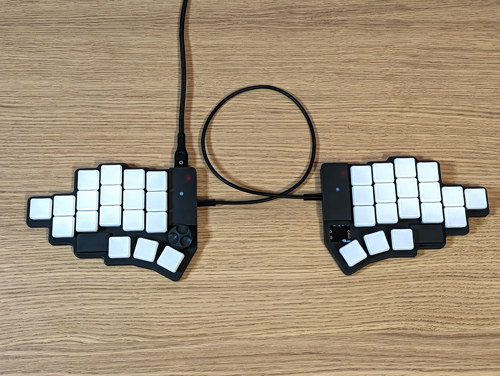
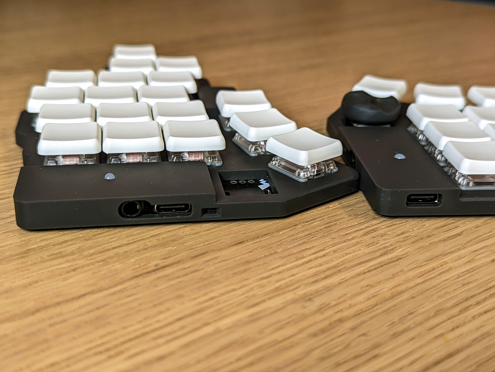
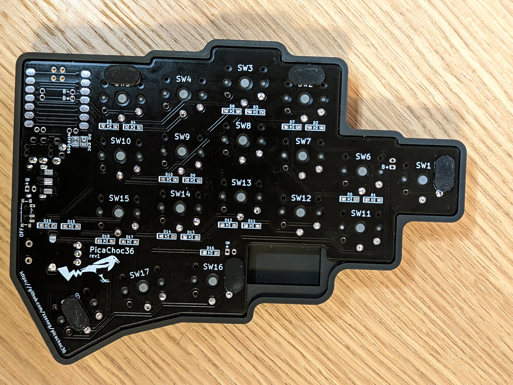
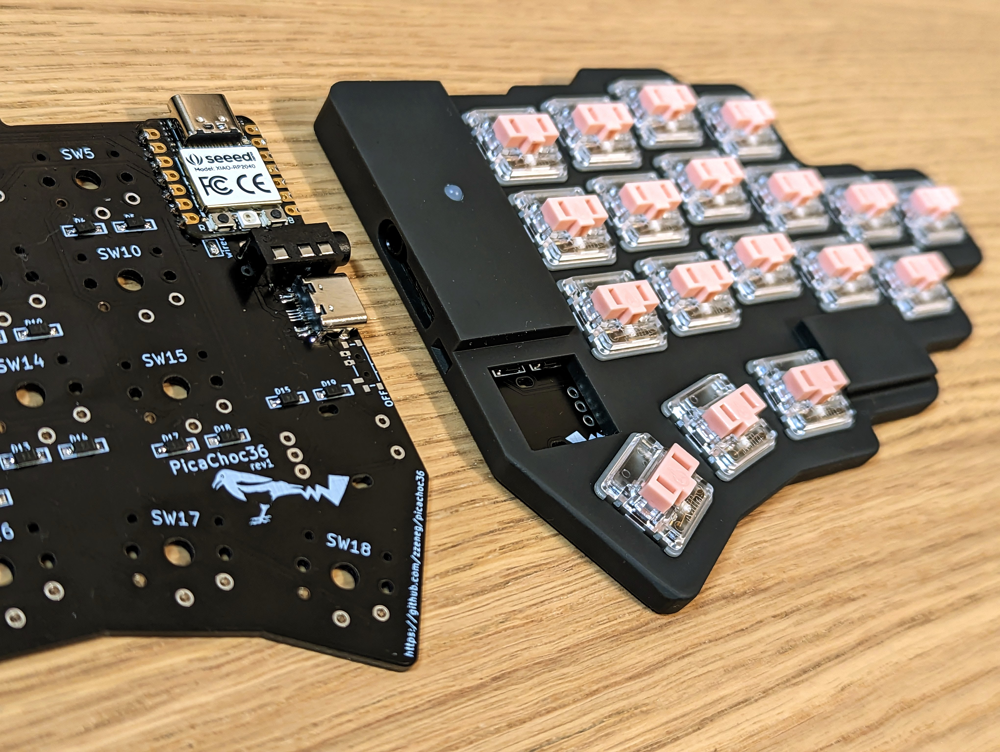
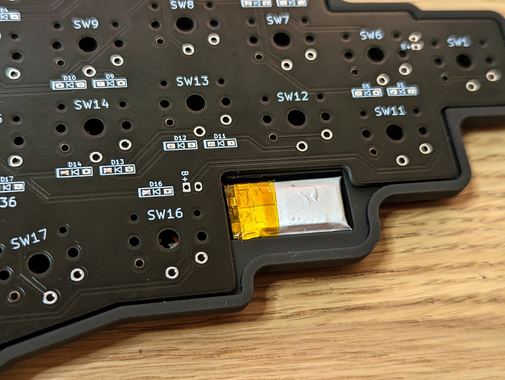
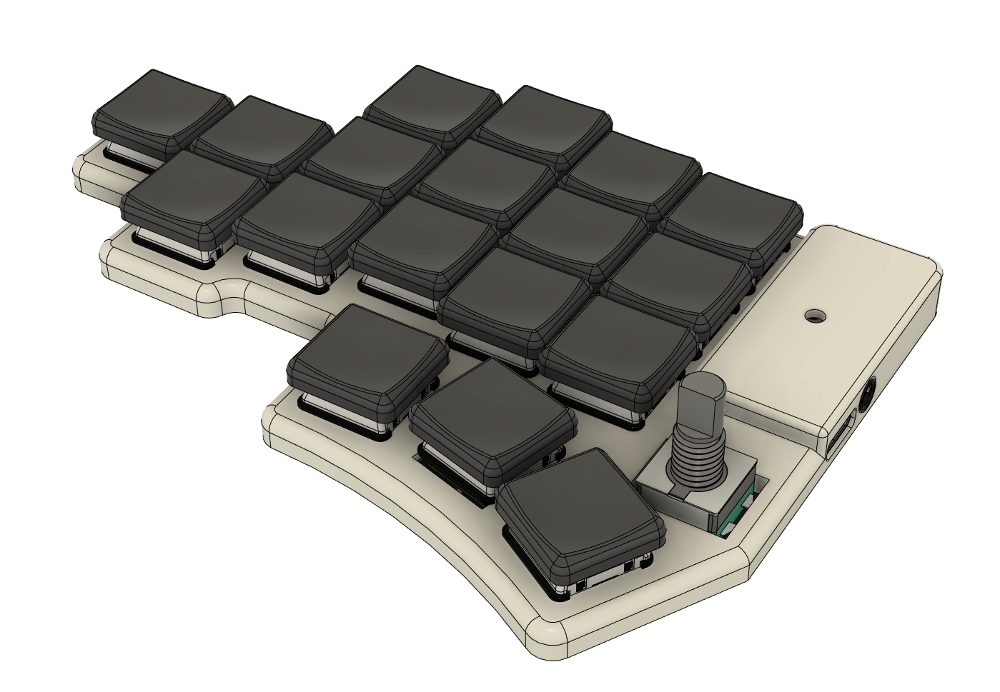

# PicaChoc36

Low-profile split keyboard with 36 keys using XIAO controllers.

_Pica pica - european (common) magpie_

## Features

- reversible PCB
- 36 soldered ChocV1 keys
- wired/wireless versions
- top pinky key moved to side
- 3D printed case

### Wired version

- XIAO RP 2040 controller
- QMK firmware
- TRRS or USB-C connection between halves
- rotary encoder on one side
- one status LED

### Wireless version

- XIAO BLE controller
- _[TODO]_ ZMK firmware
- rotary encoder on both sides (ZMK supports only main side for now)
- on/off toggle
- battery connectors

## Photos

wired version with 3d printed case

build process

battery compartment

## Firmware

- QMK - [my fork](https://github.com/zzeneg/qmk_firmware/tree/feature/picachoc36/keyboards/picachoc36), [compiled default keymap](firmware/qmk/picachoc36_default.uf2), [compiled my keymap](firmware/qmk/picachoc36_zzeneg.uf2).
- Vial - [my fork](https://github.com/zzeneg/vial-qmk/tree/feature/picachoc36/keyboards/picachoc36), [compiled my keymap](firmware/vial/picachoc36_rev1_vial-zzeneg.uf2) and [my vial config](firmware/vial/zzeneg.vil).
- _[TODO]_ ZMK

## Gerber files

- [PCB](gerbers/pcb.zip)

## Case files (STL - 3d printed)

Updated wired cases render:

- Wired - [Left](stl/Plate_case%20v2_left-wired.stl), [left without encoder hole](stl/Plate_case%20v2_left-wired-no-enc.stl), [right](stl/Plate_case%20v2_right-wired.stl), [right without encoder hole](stl/Plate_case%20v2_right-wired-no-enc.stl)
- Wireless - with battery compartment and encoder holes - [left](stl/Plate-wireless-left.stl), [right](stl/Plate-wireless-right.stl)
- _[Experimental]_ [Knob](stl/Knob.stl) for low profile rotary encoder

## Bill of materials

- PCBs
- 3D printed case
- 2 XIAO MCUs - [RP2040](https://www.seeedstudio.com/XIAO-RP2040-v1-0-p-5026.html) for wired version, [nRF52840](https://www.seeedstudio.com/Seeed-XIAO-BLE-nRF52840-p-5201.html) for wireless
- 36 Choc V1 switches
- 36 SMD SOD-123 1N4148 diodes
- 1 or 2 EC11/12 rotary encoder with knob, [low profile](https://keycapsss.com/keyboard-parts/parts/220/alps-alpine-encoder-low-profile-ec12e1220301) is recommended
- _[Wired only]_ [2x USB-C 16pin connector](https://www.aliexpress.com/item/1005003670899595.html) and TRRS jack
- _[Wired only]_ USB-C or TRRS cable
- _[Wireless only]_ 2x Li-Ion 3.7V battery (battery compartment suited for 5×12×21 size)
- _[Wireless only]_ [2x on/off toggle MSK-12C02](https://www.aliexpress.com/item/4000685483225.html)

## Build log

**TODO**

Similar to all other keyboards. Main points:

- solder diodes on **top** side
- solder jumpers - choose wired or wireless on both sides
- for wired version only - solder "no enc" jumper on the side that **does not** have encoder
- for wireless version only - solder on/off switch on **top** side
- if you want USB-C connection, I recommend to solder both TRRS and USB-C to have a backup option, better safe than sorry. Check USB-C pins with multimeter for shorts/continuity, test that encoder works (it uses connection between splits)

⚠️ It's not possible to disassemble the keyboard after soldering switches, so **before** that:

- flash your MCUs with a firmware that supports bootmagic/QK_BOOT/&reset functions
- triple check all keys with tweezers
